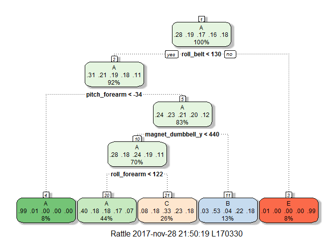
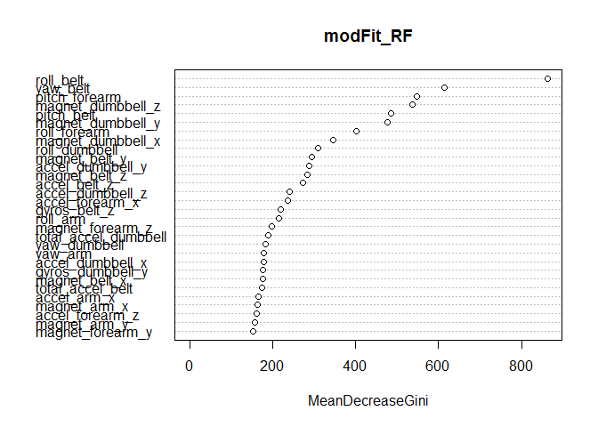

## 1. Executive summary
For this assignment the data from accelerometers on the belt, forearm, arm, and dumbell of 6 participants are used. The goal of this assignment is to predict the manner in which they did the exercise. This is the "classe" variable in the training set. I have analysed 3 models. Random Forest delivered the lowest out of sample error. Random Forest is therefor used to predict the 20 different test cases.

## 2. Used packages
The following packages are used for this assignment.

```r
library(AppliedPredictiveModeling)
library(caret)
library(randomForest)
library(rattle)
library(rpart.plot)
```

## 3. Data
### 3.1 Used data 
The data for this assignment come from this source: http://web.archive.org/web/20161224072740/http:/groupware.les.inf.puc-rio.br/har.

The training data for this project are available here:
https://d396qusza40orc.cloudfront.net/predmachlearn/pml-training.csv

The test data are available here:
https://d396qusza40orc.cloudfront.net/predmachlearn/pml-testing.csv

### 3.1 Read data

```r
training <- read.csv("pml-training.csv", na.strings = c("NA", ""))
training <- training[, colSums(is.na(training)) == 0]
testing <- read.csv("pml-testing.csv", na.strings = c("NA", ""))
testing <- testing[, colSums(is.na(testing)) == 0]
```

### 3.2 Cleaning the data

```r
dim(training)
```

```
## [1] 19622    60
```

```r
dim(testing)
```

```
## [1] 20 60
```

```r
training_nw <- training[, -c(1:7)]
testing_nw <- testing[, -c(1:7)]
```
The first 7 columns are not relevant for the assignment and are therefor deleted from the dataset. So 53 variables will be used to select a model.

### 3.3 Data Partitioning
The clean training data is split into training data (subtrain1) and test data (subtrain2). 

```r
set.seed(95014) 
inTrain = createDataPartition(training_nw$classe, p=0.7, list = FALSE)
subtrain1 = training_nw[inTrain,]
subtrain2 = training_nw[-inTrain,]
```

## 4. Selecting model

### 4.1 Lineair Discriminant Analysis
Firstly build a LDA model on dataset subtrain1. Secondly use this model to predict on the testset subtrain2. This is to test how the model works for a test data set.

```r
# Build LDA model using training dataset (subtrain1)
modFit_LDA <- train(classe ~., data = subtrain1, method = "lda")
# Use LDA model to predict on test data (subtrain2)
LDA_pred.test <- predict(modFit_LDA, subtrain2)
# Determine confusion matrix
confM_LDA <- confusionMatrix(subtrain2$classe, LDA_pred.test)
print(confM_LDA)
```

```
## Confusion Matrix and Statistics
## 
##           Reference
## Prediction    A    B    C    D    E
##          A 1370   33  146  118    7
##          B  188  713  133   52   53
##          C   98  110  658  133   27
##          D   70   39  108  701   46
##          E   43  201   93  101  644
## 
## Overall Statistics
##                                           
##                Accuracy : 0.6943          
##                  95% CI : (0.6824, 0.7061)
##     No Information Rate : 0.3006          
##     P-Value [Acc > NIR] : < 2.2e-16       
##                                           
##                   Kappa : 0.6129          
##  Mcnemar's Test P-Value : < 2.2e-16       
## 
## Statistics by Class:
## 
##                      Class: A Class: B Class: C Class: D Class: E
## Sensitivity            0.7744   0.6505   0.5782   0.6344   0.8288
## Specificity            0.9261   0.9110   0.9225   0.9450   0.9143
## Pos Pred Value         0.8184   0.6260   0.6413   0.7272   0.5952
## Neg Pred Value         0.9052   0.9193   0.9012   0.9179   0.9723
## Prevalence             0.3006   0.1862   0.1934   0.1878   0.1320
## Detection Rate         0.2328   0.1212   0.1118   0.1191   0.1094
## Detection Prevalence   0.2845   0.1935   0.1743   0.1638   0.1839
## Balanced Accuracy      0.8503   0.7808   0.7503   0.7897   0.8715
```

```r
# Calculcate out of sample error
out_of_sample_error_LDA <- 1-confM_LDA$overall[1]
```
The out of sample error of the LDA model is 0.306.

### 4.2 Decision Tree
Firstly build a Decision Tree model on dataset subtrain1. Secondly use this model to predict on the testset subtrain2. This is to test how the model works for a test data set.

```r
# Build Decision Tree model using training dataset (subtrain1)
modFit_DT<- train(classe ~ . , method = "rpart", data = subtrain1)
# Make a plot of the model
rattle::fancyRpartPlot(modFit_DT$finalModel)
```

<!-- -->

```r
# Use Decision Tree model to predict on test data (subtrain2)
DT_pred.test <- predict(modFit_DT, subtrain2)
# Determine confusion matrix
confM_DT <- confusionMatrix(subtrain2$classe,DT_pred.test)
print(confM_DT)
```

```
## Confusion Matrix and Statistics
## 
##           Reference
## Prediction    A    B    C    D    E
##          A 1509   32  130    0    3
##          B  481  347  311    0    0
##          C  476   31  519    0    0
##          D  410  178  376    0    0
##          E  128  158  312    0  484
## 
## Overall Statistics
##                                          
##                Accuracy : 0.4858         
##                  95% CI : (0.473, 0.4987)
##     No Information Rate : 0.5105         
##     P-Value [Acc > NIR] : 0.9999         
##                                          
##                   Kappa : 0.3289         
##  Mcnemar's Test P-Value : NA             
## 
## Statistics by Class:
## 
##                      Class: A Class: B Class: C Class: D Class: E
## Sensitivity            0.5023  0.46515  0.31493       NA  0.99384
## Specificity            0.9427  0.84588  0.88034   0.8362  0.88922
## Pos Pred Value         0.9014  0.30465  0.50585       NA  0.44732
## Neg Pred Value         0.6450  0.91593  0.76765       NA  0.99938
## Prevalence             0.5105  0.12676  0.28003   0.0000  0.08275
## Detection Rate         0.2564  0.05896  0.08819   0.0000  0.08224
## Detection Prevalence   0.2845  0.19354  0.17434   0.1638  0.18386
## Balanced Accuracy      0.7225  0.65552  0.59763       NA  0.94153
```

```r
# Calculcate out of sample error
out_of_sample_error_DT <- 1-confM_DT$overall[1]
```
The out of sample error of the Decision Tree model is 0.514.

### 4.3 Random Forest
Firstly build a Random Forest model on dataset subtrain1. Secondly use this model to predict on the testset subtrain2. This is to test how the model works for a test data set.

```r
# Build Random Forest model using training dataset (subtrain1)
modFit_RF <- randomForest(classe ~ . , data = subtrain1)
# Use Random Forest model to predict on test data (subtrain2)
RF_pred.test <- predict(modFit_RF, subtrain2)
# Determine confusion matrix
confM_RF <- confusionMatrix(subtrain2$classe,RF_pred.test )
print(confM_RF)
```

```
## Confusion Matrix and Statistics
## 
##           Reference
## Prediction    A    B    C    D    E
##          A 1674    0    0    0    0
##          B    5 1132    2    0    0
##          C    0    1 1022    3    0
##          D    0    0    7  956    1
##          E    0    0    0    6 1076
## 
## Overall Statistics
##                                           
##                Accuracy : 0.9958          
##                  95% CI : (0.9937, 0.9972)
##     No Information Rate : 0.2853          
##     P-Value [Acc > NIR] : < 2.2e-16       
##                                           
##                   Kappa : 0.9946          
##  Mcnemar's Test P-Value : NA              
## 
## Statistics by Class:
## 
##                      Class: A Class: B Class: C Class: D Class: E
## Sensitivity            0.9970   0.9991   0.9913   0.9907   0.9991
## Specificity            1.0000   0.9985   0.9992   0.9984   0.9988
## Pos Pred Value         1.0000   0.9939   0.9961   0.9917   0.9945
## Neg Pred Value         0.9988   0.9998   0.9981   0.9982   0.9998
## Prevalence             0.2853   0.1925   0.1752   0.1640   0.1830
## Detection Rate         0.2845   0.1924   0.1737   0.1624   0.1828
## Detection Prevalence   0.2845   0.1935   0.1743   0.1638   0.1839
## Balanced Accuracy      0.9985   0.9988   0.9952   0.9945   0.9989
```

```r
# Calculcate out of sample error
out_of_sample_error_RF <- 1-confM_RF$overall[1]
```
The out of sample error of the Random Forest model is 0.004.

For the model above all the variables have been used. What happens to the out of sample error if only the top 6 variables have been taken into account?

#### 4.4 Importance of the variables

```r
varImpPlot(modFit_RF)
```

<!-- -->

The top 6 variables are:  roll_belt, yaw_belt, pitch_forearm , magnet_dumbell_z, pitch_belt and magnet_dumbell_y.


```r
modFit_RF_6 <- randomForest(factor(classe) ~ roll_belt+yaw_belt+pitch_forearm +magnet_dumbbell_z + pitch_belt+ magnet_dumbbell_y , data = subtrain1 )
RF_pred.test_6 <- predict(modFit_RF_6, subtrain2)
confM_RF_6 <- confusionMatrix(subtrain2$classe,RF_pred.test_6 )
print(confM_RF_6)
```

```
## Confusion Matrix and Statistics
## 
##           Reference
## Prediction    A    B    C    D    E
##          A 1652    9    6    5    2
##          B   10 1106   17    4    2
##          C    2    4 1013    7    0
##          D    2    1   11  950    0
##          E    0    5    4    6 1067
## 
## Overall Statistics
##                                           
##                Accuracy : 0.9835          
##                  95% CI : (0.9799, 0.9866)
##     No Information Rate : 0.2831          
##     P-Value [Acc > NIR] : < 2.2e-16       
##                                           
##                   Kappa : 0.9792          
##  Mcnemar's Test P-Value : 0.002283        
## 
## Statistics by Class:
## 
##                      Class: A Class: B Class: C Class: D Class: E
## Sensitivity            0.9916   0.9831   0.9638   0.9774   0.9963
## Specificity            0.9948   0.9931   0.9973   0.9972   0.9969
## Pos Pred Value         0.9869   0.9710   0.9873   0.9855   0.9861
## Neg Pred Value         0.9967   0.9960   0.9922   0.9955   0.9992
## Prevalence             0.2831   0.1912   0.1786   0.1652   0.1820
## Detection Rate         0.2807   0.1879   0.1721   0.1614   0.1813
## Detection Prevalence   0.2845   0.1935   0.1743   0.1638   0.1839
## Balanced Accuracy      0.9932   0.9881   0.9806   0.9873   0.9966
```

```r
out_of_sample_error_RF_6 <- 1-confM_RF_6$overall[1]
```
The out of sample error of the Random Forest model based on only top 6 variables is 0.016.
Even with only top 6 of the variables Random Forest delivers the lowerest out of sample error comparing to LDA model and Decision Tree model.

## 5. Conclusion
Random Forest model has the lowest out of sample error. This model is used to predict the 20 different test cases.

### 5.1 Prediction of 20 different test cases.

```r
RF_pred.test2 <- predict(modFit_RF, testing_nw)
RF_pred.test2
```

```
##  1  2  3  4  5  6  7  8  9 10 11 12 13 14 15 16 17 18 19 20 
##  B  A  B  A  A  E  D  B  A  A  B  C  B  A  E  E  A  B  B  B 
## Levels: A B C D E
```
